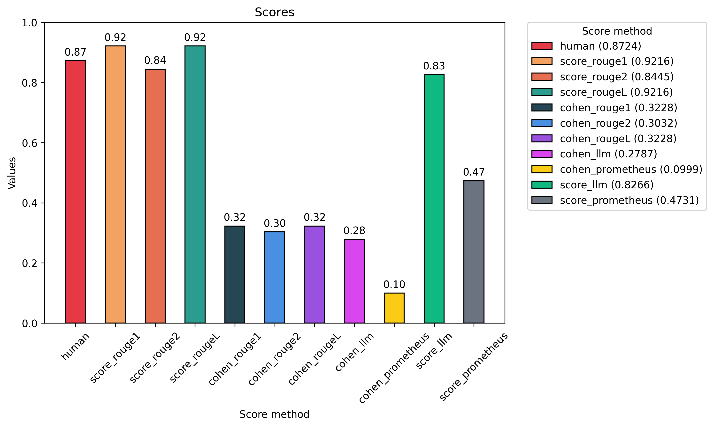
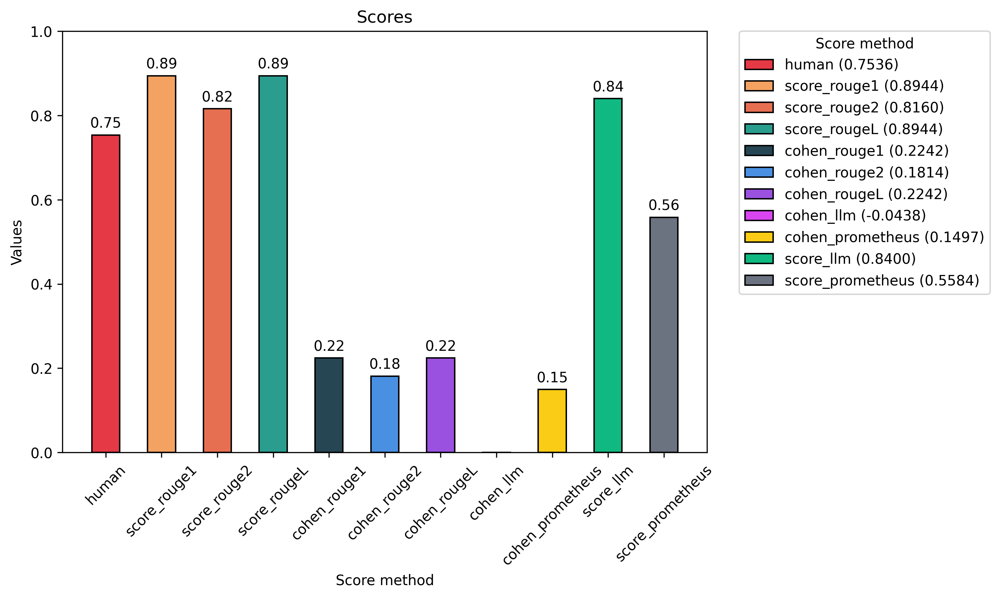

# OCR Text Cleaning (of italian text)
### Cleaning Collodi's *Le avventure di pinocchio*.

### OCR

**OCR** stands for *Optical Character Recognition* and is a technology designed to extract text from images or scanned documents. However, the output of such systems is usually very noisy and contains errors, and so here we takle the problem of cleaning and correcting it. 

## Methodology
To tackle the problem we adopt an approach based on the use of LLMs; precisely we fine-tune two base models:
- **mt5-base**: a multilingual variant of the "Text-to-Text Transfer Transformer (T5)" which is designed to map text into other text, such as in translation tasks. Therefore, it can be a strong candidate for cleaning Italian OCR-text, since also here we have a "text to text" problem ( mapping the ocr text to its cleaned version).
- **Minerva-3B-base**: an only-decoder model traned on Italian and English text. Here we adopt a generative approach to solve the problem. 


### Notes on mt5-base
A said before, *mt5* is a storng candidate for this task, since we can interpret the problem of cleaning ocr text as a translation problem, i.e. transalting the ocr-text into clean italian text. 
However, mt5 has some limitations, and the main one is surely the limited window size, which consists of only 20 tokens. So, we make a first preprocessing by slitting the original dataset into smaller samples of the kind `(orc_sample, clean_sample)`, where the criterion it's simply splitting at the end of a sentence. However, since these samples easlily exceed the windows' size, we make an additional splitting, in order to have samples of no more than 20 tokens. This however raises an additional complication, the difficulty of matching the samples, since usually we need more tokens to encode the `ocr_sample` than the ones needed to encode the tokens of the `clean_samples`. \\
In order to do so, we first encoded each sample produced in the first preprocessing step and generated the token ids. Then we used the **sequence-alignment** algorithm (used in biology to align sequences of genes) proposed by Needlman and Wunsch, to align the tokens corresponding to the ocr sample with those corresponding to the clean one. Finally, once we aligned the two sequences, we proceeded in splitting them in chunks of 20 tokens. It might seem counter-intuitive that we aligned tokens instead of the characters of the plain text, but we noticed that this leads to much better results.
For more detail see file `mt5-finetuning`.

#### Example
ocr:  
" \n—  Kagazzo  mio,  —  disse  la  Fata  —  quelli  che \ndicono  così.  Uniscono  quasi  sempre  o  in  carcere \no  all'ospedale."

clean:  
"— Ragazzo mio, — disse la Fata — quelli che dicono così, finiscono quasi sempre o in carcere o all’ospedale."

become:
```
ocr_tokens: ['▁—', '▁Kaga', 'zzo', '▁mio', ',', '▁—', '▁disse', '▁la', '▁Fata', '▁—', '▁quell', 'i', '▁che', '▁di', 'cono', '▁cos', 'ì', '.', '▁Un', '</s>'], 
clean_tokens: ['▁—', '▁Rag', 'azzo', '▁mio', ',', '▁—', '▁disse', '▁la', '▁Fata', '▁—', '▁quell', 'i', '▁che', '▁di', 'cono', '▁cos', 'ì', ',', '▁fin', '</s>']


ocr_tokens: ['iscono', '▁quasi', '▁sempre', '▁', 'o', '▁in', '▁', 'carcer', 'e', '▁', 'o', '▁all', "'", 'os', 'pedale', '.', '</s>', '<pad>', '<pad>', '<pad>'], 
clean_tokens: ['iscono', '▁quasi', '▁sempre', '▁', 'o', '▁in', '▁', 'carcer', 'e', '▁', 'o', '▁all', '’', 'os', 'pedale', '.', '</s>', '<pad>', '<pad>', '<pad>']
```

### Notes on Minerva3B-base
In this case, since the model is too big and we have limited computational resource, we couldn't perform a full fine-tuning. Therefore, we relied on **unsloth**, a library that provides a simple and efficient framework for fine-tuning LLMs. One of the key features of this library is the possibility to add LoRA adapters, which allow to train only a small number of parameters. More precisely, the idea behind **LoRA** (*Low Rank Adaption*) is that of freezing the pre-trained model's wheights and introduce a few new traineable parameters. In practice this means that we train only a small percentage of the model's paramters (1 to 10%) making the fine-tuning much faster and efficient while still keeping good performances.


## Evaluation

To evaluate the results we used different metrics:
- **Human annotations** (made by us)
- **Rouge-N**: measures the number of matching *n-grams* between the model-generated text and human-produced reference.
    -   Here we consider **rouge-1**, **rouge-2** and **rouge-L** (where rougeL measures the longest common subsequence).
- **Gemini 2.5 flash-lite** and **Prometheus as judges.
- **Cohen's kappa score** which measures how much two different scores agree between them. `-1` means complete disagreement, `1` total agreement. We used it to compare our scores with all the others.

### mt5 results

```json
{
    "human": 0.8724252491694353,
    "score_rouge1": 0.9215946843853822,
    "score_rouge2": 0.8445182724252491,
    "score_rougeL": 0.9215946843853822,
    "cohen_rouge1": 0.32277245907661234,
    "cohen_rouge2": 0.3032407407407407,
    "cohen_rougeL": 0.32277245907661234,
    "cohen_llm": 0.27873653636693696,
    "cohen_prometheus": 0.09990367612174178,
    "score_llm": 0.826578073089701,
    "score_prometheus": 0.47308970099667774
}
```


<p align="center">
    
</p>

### Minerva3B results

```json
{
    "human": 0.7535999999999999,
    "score_rouge1": 0.8944000000000001,
    "score_rouge2": 0.8160000000000001,
    "score_rougeL": 0.8944000000000001,
    "cohen_rouge1": 0.22418657137483544,
    "cohen_rouge2": 0.18136570031435573,
    "cohen_rougeL": 0.22418657137483544,
    "cohen_llm": -0.04379065928730941,
    "cohen_prometheus": 0.14972955253237186,
    "score_llm": 0.8400000000000001,
    "score_prometheus": 0.5584
}
```

<p align="center">
    
</p>
